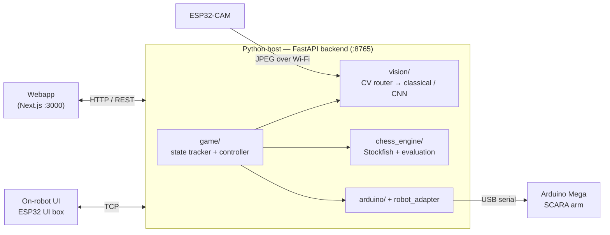

# ChArm

> A chess-playing robot that sees the board, thinks with Stockfish, and moves the pieces itself.

ChArm is a chess-playing robot built around a two-link SCARA arm with a vertical lead-screw Z axis and a servo gripper. An Arduino Mega handles motion, an ESP32-CAM captures the board, an ESP32 UI box drives an on-robot LCD/encoder interface, and a Python host runs the computer vision and chess logic that tie everything together.

<!-- TODO: add a photo / demo video of the robot in action -->

### Gameplay loop

1. The player initiates arm calibration.
2. The player starts a game and selects a difficulty and a colour to play — from either the on-robot LCD/encoder UI or the webapp.
3. The player makes a move on the physical board and confirms it with the rotary encoder (or the **Player done** button in the webapp).
4. The ESP32-CAM captures an image of the board.
5. A computer-vision algorithm and/or a CNN turns that image into two bitmaps describing piece placement.
6. Stockfish computes the best response at the selected skill level.
7. The arm physically moves the chess piece on the board.
8. The turn passes back to the human; repeat from step 3.

This README is the top-level guide to understanding, rebuilding, and running the project.

## Table of Contents

- [Main Features](#main-features)
- [Repository Layout](#repository-layout)
- [Hardware](#hardware)
- [Software Architecture](#software-architecture)
- [How the Game Flow Works](#how-the-game-flow-works)
- [Setup & Installation](#setup--installation)
- [Web Interface](#web-interface)
- [Calibration](#calibration)
- [Common Workflows](#common-workflows)
- [Current Limitations](#current-limitations)
- [Future Improvements](#future-improvements)
- [License](#license)

## Project Overview

The project is organized so that hardware control and chess/vision logic can be developed and tested independently, then integrated through a single Python host.

## Main Features

**Gameplay**
- Plays a full game of physical chess against a human, end to end
- Selectable difficulty (easy / medium / hard) powered by Stockfish
- Handles normal moves, captures, and castling
- On-robot LCD + rotary-encoder UI — no computer needed to play

**Robot / motion**
- Two-link SCARA arm with a Z lead-screw and servo gripper
- Automatic homing via limit switches and EEPROM-persisted calibration
- Cartesian pick-and-place driven over serial from the Python host

**Computer vision**
- Wi-Fi board capture via ESP32-CAM
- Two-stage perspective rectification and 8×8 grid splitting
- CNN square classifier (empty / white / black) with a classical fallback pipeline
- Self-improving "living dataset" — corrected squares feed the next training cycle

**Move understanding**
- Reconstructs the human's move by matching the observed board against all legal moves
- Validates each observation (legal / unchanged / invalid / ambiguous) and re-captures bad frames

## Repository Layout

```text
2026sp-ChArm/
├── arduino_code/                 PlatformIO project for the Arduino Mega
│   ├── src/                      Firmware entry points and hardware classes
│   ├── esp32_cam_mega_bridge/    ESP32-CAM ↔ Mega bridge sketches
│   └── esp32_ui_box/             ESP32 UI box firmware
├── docs/                         Project documentation
│   └── CAD/                      Project CAD files
├── python_code/                  Python host-side code
│   ├── src/charm/
│   │   ├── vision/               Board calibration and image processing
│   │   ├── chess_engine/         Stockfish integration
│   │   ├── game/                 Board state tracking and orchestration
│   │   ├── arduino/              Serial and UI bridges
│   │   └── utils/                Shared helpers
│   ├── tests/                    Unit tests and demos
│   ├── play_game.py              Full game entry point
│   ├── main.py                   Vision / integration runner
│   └── capture_game_session.py   Raw image capture helper
├── Simulation/                   Prototyping / simulation files
├── webapp/                       Optional Next.js frontend
└── webapp_backend/               Optional FastAPI backend
```
## Hardware

### Mechanical

- **SCARA arm** — two 250 mm links (~500 mm reach), belt-reduced rotational joints
  - J1 (base): 20 → 160 tooth reduction
  - J2 (elbow): 18 → 105 tooth reduction
- **Z axis** — 290 mm-travel vertical lead screw (4-start, 2 mm pitch → 8 mm/rev)
- **Gripper** — servo-driven, 0°–65° open/close span
- **Motors** — 3× 1.8° / 200-step steppers at 16× microstepping (the lead screw runs at 2× microstepping)

### Electronics and Wiring

**Main Arduino circuit**

- **Arduino Mega 2560** — motion control, calibration, EEPROM persistence
- **ESP32-CAM** (AI-Thinker) — Wi-Fi board capture, HTTP `/capture` endpoint
- **ESP32 UI box** — 16×2 LCD + rotary encoder/button, TCP link to host
- **3× STEP/DIR stepper drivers**
- **4× limit switches** — J1 home, 2× J2 home, Z bottom; wired to a veroboard in a pull-up configuration and read by the Arduino
- **Power supply** — 12 V at 5 A for the motors (through the CNC shield); a buck converter supplies the 5 V components (camera, servo, etc.)

**UI box**

- Needs only 5 V power, distributed to the correct pins on a veroboard. The data pins of the LCD and the button connect to an ESP32 that handles transmission to the host.


### Fabrication Tools

- **Metal lathe and drill press** — machining the flanges at the base
- **3D printer** — most of the parts around the arm
- **Laser cutter** — structural parts that would not print well
- **Soldering equipment** — wiring and connectors

### CAD Overview

The CAD files for the printed and laser-cut parts live in [docs/CAD/](docs/CAD/).

**Build order (high level)**

1. Machine the base flanges, on the lathe/drill.
2. Print the 3D printed parts available in the CAD files
3. Laser cut the DXF files in the CAD files
3. Cut 3 320 size 8mm metal rods
4. There are a lot of heat inserts needed so make sure you put them nicely.
5. Once the heat inserts are you can start building the 6 main modules to assemble (box, base, arm, lcd, display, camera arm, chessboard)
6. Next step is to solder and add jst connectors to the 4 main electronical componeents (one camera power veroboard, 1 ui box veroboard, the limist switch themsevles and its pull up resistor veroboard)
7. Now that everything is assembled just wire up the electronics as in the diagram
8. flash the firmware using the ./install.sh utility
9. start playing

### Configuration Files

Two firmware headers hold the values worth checking whenever the robot is rebuilt or re-tuned:

- [config.h](arduino_code/src/hardware/src/config.h) — motion and geometry constants (gear ratios, link lengths, steps/mm, gripper angles, pick/place heights).
- [pins.h](arduino_code/src/hardware/src/pins.h) — the microcontroller pin assignments.

## Software Architecture

ChArm is a distributed system. A Python backend orchestrates the game and talks
to a web/embedded frontend, three microcontrollers, and a chess engine. The
backend — `webapp_backend/api_server.py`, a FastAPI service on port `8765` — is
the single source of truth: both the webapp and the on-robot LCD drive the
**same** game session through it.



The rest of this section documents each layer, bottom-up: the **embedded
firmware** on the microcontrollers, then the **Python host** modules.

### Embedded Firmware

Three microcontrollers each run their own firmware: the Arduino Mega for motion,
the ESP32-CAM for board capture, and the ESP32 UI box for the player interface.

#### Arduino Mega — motion control

The main Arduino entry point is [arduino_code/src/main.cpp](arduino_code/src/main.cpp).

It is responsible for:

- setting up steppers, joints, gripper, lead screw, and limit switches
- handling calibration and EEPROM persistence
- receiving serial commands
- translating high-level movement requests into robot motion

Key hardware abstractions are in `arduino_code/src/hardware/src/`:

- `StepperXYZ`
- `ScaraJoint`
- `LeadScrew`
- `ScaraKinematics`
- `ScaraArm`
- `Gripper`
- `LimitSwitch`

The PlatformIO environments are defined in [arduino_code/platformio.ini](arduino_code/platformio.ini).

#### ESP32-CAM — board capture

The ESP32-CAM firmware is in [arduino_code/esp32_cam_mega_bridge/esp32_cam_code_mit.ino](arduino_code/esp32_cam_mega_bridge/esp32_cam_code_mit.ino).

Upload it to an AI Thinker ESP32-CAM board with the Arduino ESP32 core. Before flashing, set the `ssid` and `password` constants in the sketch to the Wi-Fi network used by the Python host.

At runtime, the board:

- connects to Wi-Fi and starts an HTTP server on port `80`
- exposes `/capture` as a JPEG image endpoint for browser or Python capture
- exposes `/status` as a small JSON health endpoint
- exposes `/` as a camera settings endpoint

#### ESP32 UI box — player interface

The ESP32 firmware for the UI box is in
[arduino_code/esp32_ui_box/](arduino_code/esp32_ui_box/).

Before flashing it, edit `WIFI_CREDENTIALS` in [arduino_code/esp32_ui_box/esp32_ui_box.cpp](arduino_code/esp32_ui_box/esp32_ui_box.cpp). The UI box and the Python host must be on the same Wi-Fi network. If no configured network is reachable, the firmware starts a fallback access point.

The LCD shows the ESP32 IP address after Wi-Fi connects; enter that address in the webapp (or backend connect request) so the host can reach the UI box.

The UI box exchanges newline-terminated TCP commands with the Python host. The main ESP32-to-Python commands are `CHECK_BOARD`, `PLAYER_DONE`, `SET_COLOR <n>`, `SET_DIFFICULTY <n>`, and `CALIBRATION`. Python replies with status updates such as `BOARD_OK`, `BOARD_FAIL`, `BOT_THINKING`, `BOT_MOVING`, `PLAYER_TURN_WHITE`, `PLAYER_TURN_BLACK`, `MOVE_DONE`, and `GAME_OVER <reason>`.

### Python Host

At runtime the FastAPI backend wires together four packages under
`python_code/src/charm/`:

| Package | Responsibility |
|---|---|
| `vision/` | Capture → rectify → classify into two 8×8 occupancy/colour bitmaps |
| `game/` | Track board state, reconstruct the human's move, orchestrate turns |
| `chess_engine/` | Stockfish move selection and position evaluation |
| `arduino/` | Serial/TCP bridges to the SCARA arm and the UI box |

#### Computer Vision (`vision/`)

The vision stack turns a single raw ESP32-CAM frame into two 8×8 bitmaps (white
pieces and black pieces) for the move tracker. It runs **two interchangeable
pipelines** — a classical CV algorithm and a trained CNN — that share the same
pre-processing and the same bitmap output format, selected at runtime by a
router (`cv_router.py`).

Key files: `pipeline.py`, `board_detector.py`, `grid_splitter.py`,
`occupancy_detector.py`, `piece_color_detector.py`, `cnn_classifier.py`,
`cv_router.py`, `four_point_calibration.py`, `calibrated_pipeline.py`.

##### Geometric pre-processing (shared)

Both pipelines start from the same stage, which transforms a raw,
perspective-distorted camera image into a normalized 8×8 board representation.

**Two-stage perspective warping** — two sequential homographies align the board:

1. **Global warp** — the four calibrated outer corners map to an 800×800 square.
2. **Inner refinement** — internal grid intersections refine that warp,
   correcting lens distortion and small geometric error so every square lands
   consistently.

**Grid splitting**

The refined image is divided into 64 `SquareCell` objects. Each cell contains:

- an RGB crop of one board square
- its row and column indices within the 8×8 grid

##### Classical pipeline — the vision algorithm

The original, training-free path (`pipeline.py`) classifies each of the 64 cells
with handcrafted heuristics:

- **occupancy detection** — decides whether a square holds a piece
- **piece-colour detection** — classifies an occupied square as white or black
- the per-cell results are assembled into the white/black 8×8 bitmaps

This pipeline needs no model and serves as the fallback when the CNN is
unavailable or fails to produce a valid board.

##### CNN classifier

The CNN classifier (`cnn_classifier.py`) replaces step 4 of the classical
pipeline (occupancy + colour thresholds) with a single learned model trained on
the ChArm board and piece set by `train_cnn.py`. `CnnBoardClassifier` wraps a
trained **Keras / TensorFlow** model, loaded once and reused across requests.

**Model objective**

The classifier predicts one of three classes for each square:

- `empty`
- `white`
- `black`

**Model structure**

A lightweight Keras CNN runs efficiently on CPU:

- input: normalized RGB square image
- three convolutional blocks with increasing filter counts
- max-pooling for spatial downsampling
- global average pooling for robustness to slight piece offsets
- softmax output over the three classes

**Batch inference**

Instead of processing cells individually, all 64 board squares can be stacked into a single tensor and passed through the model in one forward pass. This allows the whole board to be evaluated efficiently and consistently.

##### Primary / fallback routing (`cv_router.py`)

To stay robust under shadows, blur, or unclear piece placement, the router
attempts multiple captures and evaluates them in sequence:

1. first attempts use the primary pipeline (typically the CNN)
2. if repeated fresh captures still fail to produce a valid board update, the
   system falls back to the other pipeline (the classical algorithm)
3. only observations that can be matched to a valid board-state transition are
   accepted

**Validation rule**

An observation is only accepted if the `BoardStateTracker` can interpret it as:

- a unique legal move

If the result is invalid or ambiguous, the frame is rejected and a new capture
is requested.

##### Living dataset and continuous improvement

The CNN improves from real operation through a correction loop: when a square is
misclassified, the user relabels it, the cell crop is added to the dataset, and
the next training run includes it. Over time the model specializes to the actual
board texture, lighting, pieces, and camera noise — reducing reliance on
hand-tuned thresholds.

#### Move Understanding (`game/`)

Reconstructs chess state from vision output and orchestrates the turn loop:

- `state_tracker.py` — `BoardStateTracker` holds the `python-chess` position and infers the played move from the observed bitmaps
- `vision_integration.py` — adapts vision output into the tracker
- `game_session.py` — `GameSession` handles initialization, player-move detection, and robot-move verification
- `game_controller.py` — `GameController` coordinates UI events, capture, Stockfish, and arm motion

#### Chess Engine (`chess_engine/`)

- `best_move.py` — wraps Stockfish and returns the engine move for a position at the selected skill level
- `evaluation.py` — position evaluation, move ratings, and win-probability used for player feedback

#### Hardware Bridges (`arduino/`)

- `arduino_bridge.py` — sends Cartesian pick-and-place commands to the Arduino Mega over USB serial
- `uiController_bridge.py` — `ArduinoUIControllerLink`, the TCP link to the ESP32 UI box

The backend's `webapp_backend/robot_adapter.py` owns the serial connection and a
lock, so the LCD and the webapp can both drive the arm without colliding.

## How the Game Flow Works

At a high level:

1. `./start.sh` launches the host backend (`webapp_backend/api_server.py`) and the webapp.
2. The backend connects to:
   - the **ESP32 UI box** over TCP (`ArduinoUIControllerLink`)
   - the **Arduino Mega** over USB serial (`robot_adapter`)
   - the **ESP32-CAM** over Wi-Fi for board capture

   The LCD and the webapp share this one backend, so either can drive the game.
3. The user starts the game from the UI (or webapp) and picks colour and difficulty.
4. The backend validates the initial board from a calibrated image.
5. After each player move, the backend:
   - captures a new board image,
   - runs the vision pipeline,
   - reconstructs the move with `python-chess`,
   - validates whether the observation is acceptable.
6. Stockfish computes the robot response.
7. The Arduino executes the robot move physically.

The tracker statuses currently used by the move-validity layer are:

- `accepted_legal_move`
- `unchanged_position`
- `invalid_observation`
- `ambiguous_observation`

## Setup & Installation

We provide a cross-platform setup wizard and launcher scripts that run on **Windows, macOS, and Linux**.

### What the Setup Wizard Does
The setup wizard automates the entire installation and deployment pipeline:
1. **Prerequisite Check**: Verifies that Python 3 and Node.js/NPM are present on your machine.
2. **Python Environment**: Automatically creates a local virtual environment (`venv/` in the root) and installs all required dependencies (including **PlatformIO** so you do not need Arduino IDE).
3. **Frontend Dependencies**: Installs React/Next.js frontend libraries in the `webapp/` folder.
4. **Firmware Wizard**: Runs a step-by-step firmware compiling and uploading flow. It automatically scans your computer's USB/Serial ports, displays them, and lets you select the correct port for:
   - **ESP32-CAM** (Mega Bridge)
   - **ESP32 UI Box**
   - **Arduino Mega 2560**
5. **Startup Shortcuts**: Creates root launcher scripts (`start.sh` for Linux/macOS, `start.bat` for Windows) targeting the virtual environment.

---

### Step 1: Run the Installation Script

1. **Linux / macOS**:
   ```bash
   ./install.sh
   ```
2. **Windows**:
   Double-click or run from CMD:
   ```cmd
   install.bat
   ```

Follow the prompts to configure Node dependencies and select your serial ports to flash the hardware controllers.

> [!NOTE]
> Make sure to install Stockfish separately if it is not already available on your machine:
> - **Debian/Ubuntu**: `sudo apt install stockfish`
> - **macOS**: `brew install stockfish`
> - **Windows**: Download the binary from the official Stockfish site and add it to your PATH.

---

### Step 2: How to Launch the App

Once setup is complete, you can launch both backend and frontend servers with a single command:

1. **Linux / macOS**:
   ```bash
   ./start.sh
   ```
2. **Windows**:
   ```cmd
   start.bat
   ```

This will automatically load the virtual environment and start the FastAPI webserver and React dashboard concurrently.

## Web Interface

Once the app is running, open the webapp at <http://localhost:3000>. It is the
control center for the whole robot: you can play a game, configure the vision
pipeline, train and activate a CNN, label training data, and calibrate the arm —
all without touching a terminal.

### Built-in Guide page

The webapp ships with its own **Guide** page that walks through every screen,
explains what each control does, and ends with a "Starting a Game" checklist. It
lives at <http://localhost:3000/guide> and is the most up-to-date, canonical
reference for using the interface — start there rather than memorizing the
sections below.

### Pages at a glance

| Page | Route | What it's for |
|---|---|---|
| Dashboard | `/` | Play a game, live board view, arm calibration, **Run LCD** sync |
| Vision Pipeline | `/lab` | Debug the classical CV output stage-by-stage; tune the occupancy threshold and warp |
| Vision Settings | `/lab/vision-settings` | CV router (classical vs. CNN), auto-save of training frames, active CNN model |
| Labeling Wizard | `/lab/labeling` | Build labeled datasets via arm-driven capture or bulk painting |
| CNN Wizard | `/lab/cnn` | Train a model on a dataset and activate it for live play |
| SCARA Calibration | `/robot` | Teach the arm the board corners (a1, h1, h8) |
| Guide | `/guide` | In-app walkthrough of all of the above |

The Serial Monitor bar at the bottom of every page streams the commands sent to
the Arduino arm (TX) and its responses (RX) for live debugging.

## Calibration

The Python vision stack expects calibration JSON files:

- `python_code/board_calibration.json`
- `python_code/inner_warp_calibration.json`

Calibration-related scripts live in:

- `python_code/src/charm/vision/calibrate_board_corners.py`
- `python_code/src/charm/vision/calibrate_inner_warp_corners.py`
- `python_code/src/charm/vision/run_two_step_calibration.py`
- `python_code/manual_calibration_interactive.py`

The typical workflow is:

1. capture or load a board image,
2. calibrate the outer board corners,
3. calibrate the inner warp / refined board area,
4. save both calibration files,
5. use those files when running the game pipeline.

## Common Workflows

### Play a game

This is the normal way to run ChArm. From the repo root:

```bash
./start.sh
```

`start.sh` runs `npm run dev`, which launches **both** the Python vision/game
backend (`webapp_backend/api_server.py`, port `8765`) and the Next.js frontend
(port `3000`). Then either:

- open the webapp at <http://localhost:3000>

From there: calibrate the arm (mandatory), start a game, pick colour and difficulty, make
your move on the physical board, and confirm it. The backend captures the board,
runs the vision pipeline, validates your move, asks Stockfish for the reply, and
drives the arm.

### Calibrate the board (vision)

The board calibration is done from the webapp:

1. Click **Manual calibration**.
2. Capture a new picture.
3. Adjust the outer corners, then the inner warp — click **Save** and
   **Calibrate** between each step.

This writes `board_calibration.json` and `inner_warp_calibration.json`, which the
game pipeline then loads automatically.

### Improve the CNN (living-dataset loop)

Training data accumulates in `python_code/labeled_datasets/`. There are two ways
to grow it.

**During play (passive)** — every validated board frame is sliced into 64
labeled cell crops and saved automatically, so the dataset grows just by playing.

**With the labeling wizard (webapp)** — the webapp has a dedicated labeling page
for building datasets quickly and consistently. It supports two capture modes:

- **Autonomous (arm-driven) capture** — the robot picks pieces from a source
  square and places them across the board on its own, homing out of frame before
  each shot. This produces large, correctly-labeled datasets with no manual
  effort, since the label is whatever the arm just placed.
- **Bulk painting** — the "painted-board" mode: set up many pieces at once, paint
  each square's label (empty / white / black) on the on-screen grid, then hit
  capture. One photo yields a labeled crop for every painted square.

<!-- TODO: add screenshots / video of the labeling page, autonomous capture, and bulk painting -->

**Train and deploy** — once a dataset looks good (the wizard can also compute
per-square accuracy stats), build and train:

```bash
source venv/bin/activate
# optional: review crops one-by-one and drop bad ones
python python_code/validate_labels.py
# train on a prepared dataset folder
python python_code/train_cnn.py --dataset cnn_<name> --epochs 20
```

The resulting model is then used by the CNN classifier for the next session.

## Current Limitations

- The move tracker currently works from **occupancy + piece colour**, not full piece identity.
- Because of that, the system relies on a **known previous chess position** and infers the move by iterating over legal moves.
- Promotion cannot be uniquely identified from occupancy/colour alone if multiple promotion pieces would produce the same bitmap pattern.
- Real-world robustness still depends on lighting, calibration quality, and board visibility.

<!-- TODO: review limitations as a team -->

## Future Improvements

Some realistic next steps are:

### Mechanical

- Increase arm speed while preserving repeatability and positional accuracy.
- Design a better enclosure/box for cleaner integration of electronics and mechanics.
- Improve stepper-driver heat management to reduce overheating risks during longer runs.
- Machine critical joint components, especially the axle section linking the forearm to the joint pulley, to improve rigidity and reduce play.
- Reduce backlash and improve overall structural stiffness in the SCARA linkage.

### Vision and Software

- Add automated retraining workflows for the continuously growing dataset.
- Strengthen end-to-end robustness across different lighting conditions and camera positions.

### System Integration

- Add clearer player feedback when invalid or ambiguous board states are detected.
- Extend the UI to expose more debugging and calibration information.
- Improve synchronization between board verification, move planning, and robot execution.

## License

Hardware designs are licensed under
[Creative Commons Attribution 4.0](LICENSE-CC-BY-4.0).

Unless otherwise noted, the code in this repository is licensed under the
[MIT License](LICENSE).
