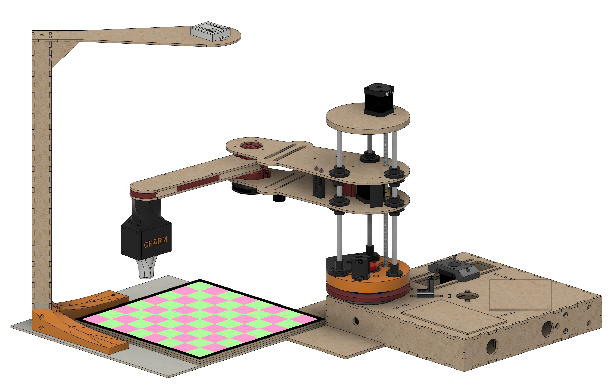
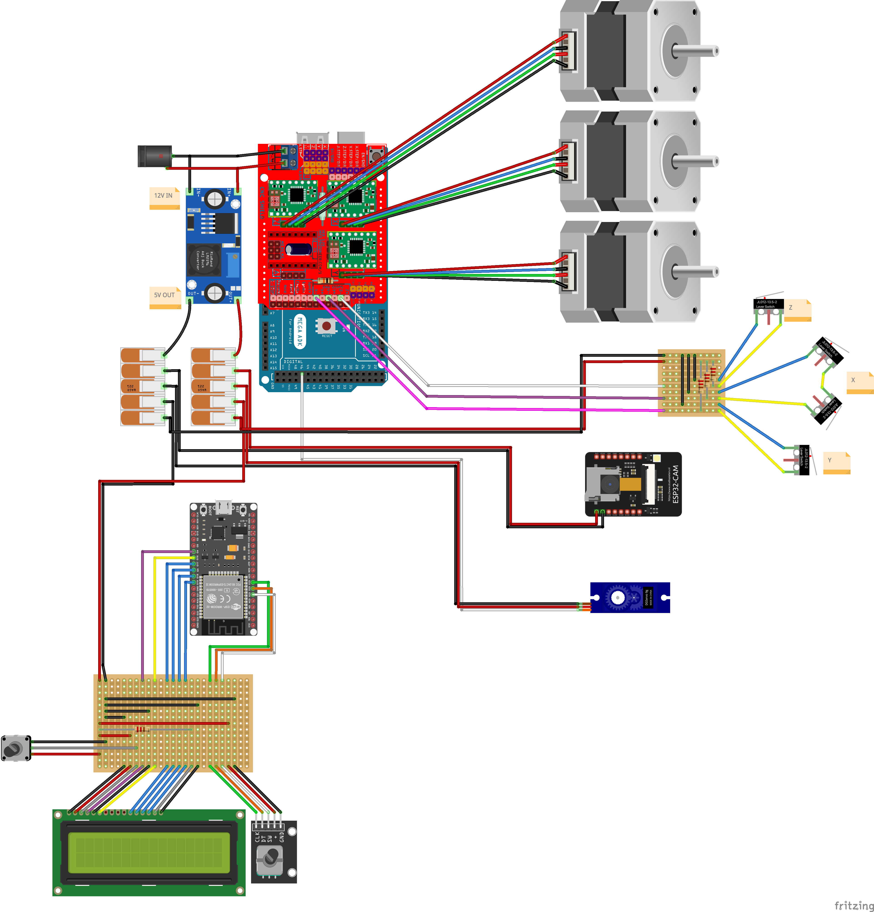
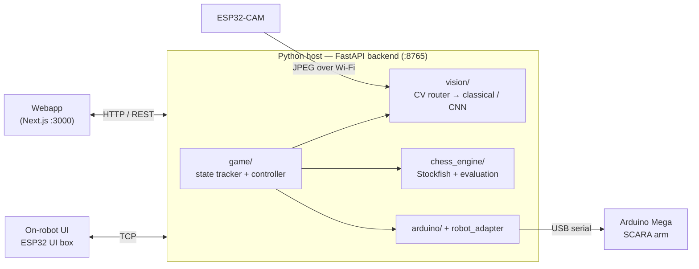
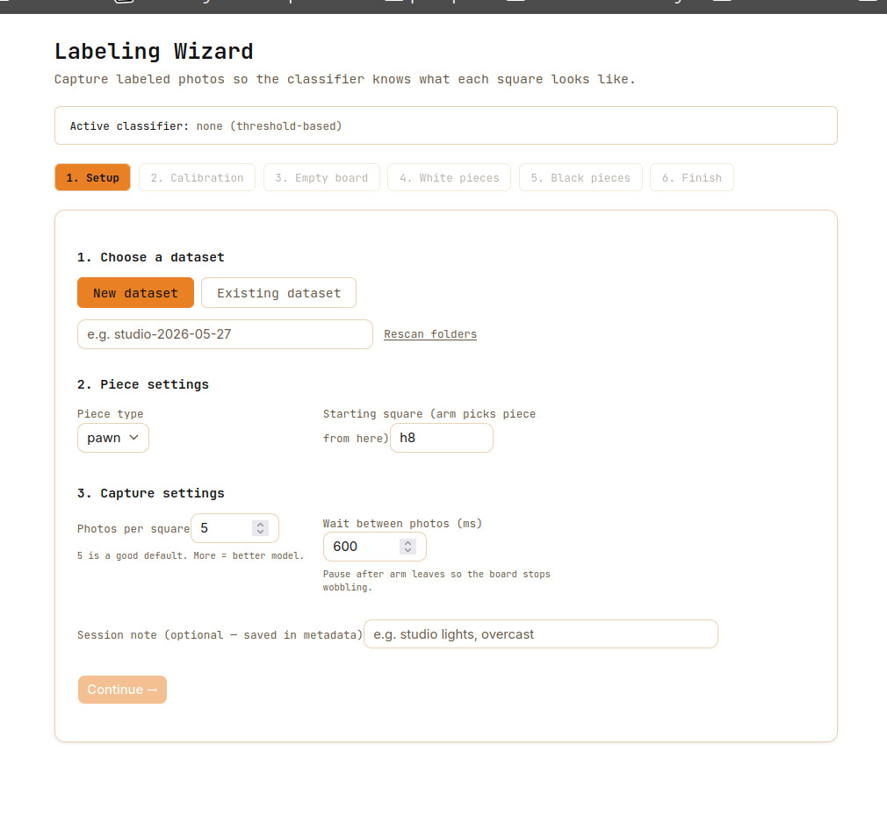
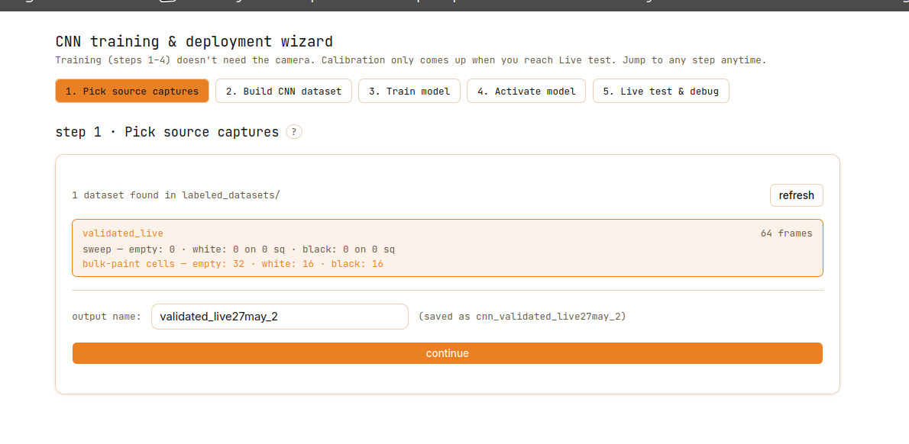
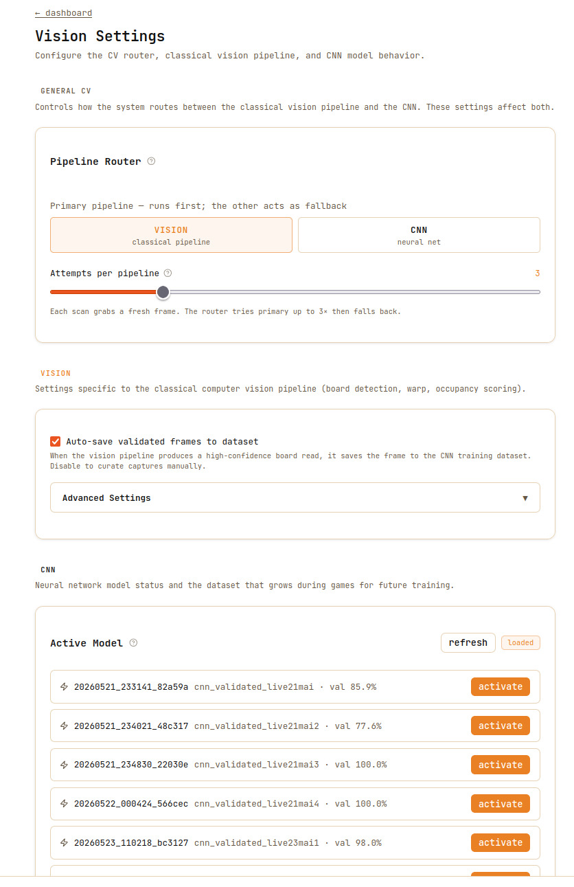
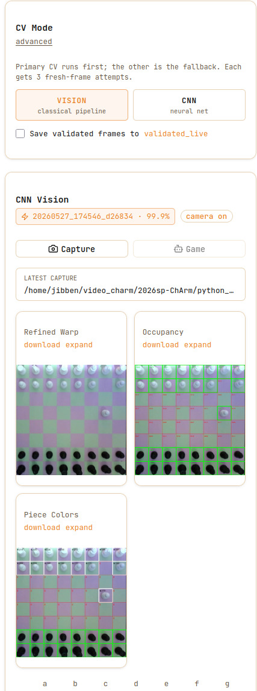
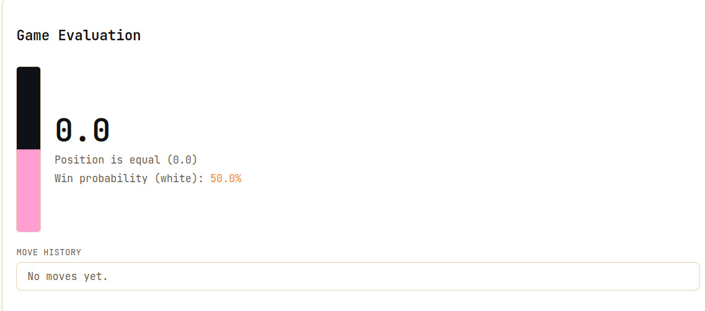

# ChArm

> A chess-playing robot arm that sees the board, thinks with Stockfish, and moves the pieces itself.

ChArm is a chess-playing robot arm built around a two-link SCARA arm with a vertical lead-screw Z axis and a servo gripper. An Arduino Mega handles motion, an ESP32-CAM captures the board, an ESP32 UI box drives an on-robot LCD/encoder interface, and a Python host runs the computer vision and chess logic that tie everything together.

<video width="640" height="480" controls>
  <source src="docs/ChArm trailer.mp4" type="video/mp4">
</video>

### Gameplay loop

1. The player initiates arm calibration.
2. The player starts a game and selects a difficulty and a color to play — from either the on-robot LCD/encoder UI or the webapp.
3. The player makes a move on the physical board and confirms it with the rotary encoder (or the **Player done** button in the webapp).
4. The ESP32-CAM captures an image of the board.
5. A computer-vision algorithm and/or a CNN turns that image into two bitmaps describing piece placement.
6. Stockfish computes the best response at the selected skill level.
7. The arm physically moves the chess piece on the board.
8. The turn passes back to the human; repeat from step 3.

This README is the top-level guide to understanding, rebuilding, and running the project.

## Table of Contents

- [Main Features](#main-features)
- [Repository Layout](#repository-layout)
- [Hardware](#hardware)
- [Software Architecture](#software-architecture)
- [How the Game Flow Works](#how-the-game-flow-works)
- [Setup & Installation](#setup--installation)
- [Web Interface](#web-interface)
- [Calibration](#calibration)
- [Common Workflows](#common-workflows)
- [Current Limitations](#current-limitations)
- [Future Improvements](#future-improvements)
- [License](#license)

## Project Overview

The project is organized so that hardware control and chess/vision logic can be developed and tested independently, then integrated through a single Python host.

## Main Features

**Gameplay**
- Plays a full game of physical chess against a human, end to end
- Selectable difficulty (1-20) powered by Stockfish
- Handles normal moves, captures, castling and promotion
- On-robot LCD + rotary-encoder UI — no computer needed to play

**Robot / motion**
- Two-link SCARA arm with a Z lead-screw and servo gripper
- Automatic homing via limit switches and EEPROM-persisted calibration
- Cartesian pick-and-place driven over serial from the Python host

**Computer vision**
- Wi-Fi board capture via ESP32-CAM
- Two-stage perspective rectification and 8×8 grid splitting
- CNN square classifier (empty / white / black) with a classical fallback pipeline
- Self-improving "living dataset" — corrected squares feed the next training cycle

**Move understanding**
- Reconstructs the human's move by matching the observed board against all legal moves
- Validates each observation (legal / unchanged / invalid / ambiguous) and re-captures bad frames

## Repository Layout

```text
2026sp-ChArm/
├── arduino_code/                 PlatformIO project for the Arduino Mega
│   ├── src/                      Firmware entry points and hardware classes
│   ├── esp32_cam_mega_bridge/    ESP32-CAM ↔ Mega bridge sketches
│   └── esp32_ui_box/             ESP32 UI box firmware
├── docs/                         Project documentation
│   └── CAD/                      Project CAD files
├── python_code/                  Python host-side code
│   ├── src/charm/
│   │   ├── vision/               Board calibration and image processing
│   │   ├── chess_engine/         Stockfish integration
│   │   ├── game/                 Board state tracking and orchestration
│   │   ├── arduino/              Serial and UI bridges
│   │   └── utils/                Shared helpers
│   ├── tests/                    Unit tests and demos
│   ├── play_game.py              Full game entry point
│   ├── main.py                   Vision / integration runner
│   └── capture_game_session.py   Raw image capture helper
├── Simulation/                   Prototyping / simulation files
├── webapp/                       Optional Next.js frontend
└── webapp_backend/               Optional FastAPI backend
```
## Hardware

### Mechanical

- **SCARA arm** — two 250 mm links (~500 mm reach), belt-reduced rotational joints
  - J1 (base): 20 → 160 tooth reduction
  - J2 (elbow): 18 → 105 tooth reduction
- **Z axis** — 290 mm-travel vertical lead screw (4-start, 2 mm pitch → 8 mm/rev)
- **Gripper** — servo-driven, 0°–65° open/close span
- **Camera arm** — fixed to the chessboard with a 3D-printed support screwed
  into the board, and a camera mount holds the ESP32-CAM at a stable viewing angle
- **Motors** — 3× 1.8° / 200-step steppers at 16× microstepping (the lead screw runs at 2× microstepping)



### Electronics and Wiring

**Main Arduino circuit**

- **Arduino Mega 2560** — motion control, calibration, EEPROM persistence
- **ESP32-CAM** (AI-Thinker) — Wi-Fi board capture, HTTP `/capture` endpoint
- **ESP32 UI box** — 16×2 LCD + rotary encoder/button, TCP link to host
- **3× STEP/DIR stepper drivers**
- **4× limit switches** — J1 home, 2× J2 home, Z bottom; wired to a stripboard in a pull-up configuration and read by the Arduino
- **Power supply** — 12 V at 5 A for the motors (through the CNC shield); a buck converter supplies the 5 V components (camera, servo, etc.)

**UI box**

- Needs only 5 V power, distributed to the correct pins on a stripboard. The data pins of the LCD and the button connect to an ESP32 that handles transmission to the host.



### Fabrication Tools

- **Metal lathe and drill press** — machining the flanges at the base
- **3D printer** — most of the parts around the arm
- **Laser cutter** — structural parts that would not print well
- **Soldering equipment** — wiring and connectors

### CAD Overview

The CAD files for the printed and laser-cut parts live in [docs/CAD/](docs/CAD/).

**Build order (high level)**

1. Machine the base flanges, on the lathe/drill.
2. Print the 3D printed parts available in the CAD files
3. Laser cut the DXF files in the CAD files
3. Cut 3 320 size 8mm metal rods
4. There are a lot of heat inserts needed so make sure you put them nicely.
5. Once the heat inserts are inserted you can start building the 6 main modules to assemble (box, base, arm, lcd, display, camera arm, chessboard)
6. Next step is to solder and add jst connectors to the 4 main electrical components (one camera power stripboard, 1 ui box stripboard, the limit switch themselves and its pull up resistor stripboard)
7. Now that everything is assembled just wire up the electronics as in the diagram
8. flash the firmware using the ./install.sh utility
9. start playing

### Configuration Files

Two firmware headers hold the values worth checking whenever the robot is rebuilt or re-tuned:

- [config.h](arduino_code/src/hardware/src/config.h) — motion and geometry constants (gear ratios, link lengths, steps/mm, gripper angles, pick/place heights).
- [pins.h](arduino_code/src/hardware/src/pins.h) — the microcontroller pin assignments.

## Software Architecture

ChArm is a distributed system. A Python backend orchestrates the game and talks
to a web/embedded frontend, three microcontrollers, and a chess engine. The
backend (`webapp_backend/api_server.py`, a FastAPI service on port `8765`) is
the single source of truth: both the webapp and the on-robot LCD drive the
**same** game session through it.



The rest of this section documents each layer, bottom-up: the **embedded
firmware** on the microcontrollers, then the **Python host** modules.

### Embedded Firmware

Three microcontrollers each run their own firmware: the Arduino Mega for motion,
the ESP32-CAM for board capture, and the ESP32 UI box for the player interface.

#### Arduino Mega — motion control

The main Arduino entry point is [arduino_code/src/main.cpp](arduino_code/src/main.cpp).

It is responsible for:

- initialising steppers, joints, gripper, lead screw, and limit switches on boot
- homing all axes via limit switches before any motion
- running a guided 3-corner board calibration wizard (`cal` command) and saving the result to EEPROM
- receiving serial commands from the Python host and executing them
- translating high-level commands like `pick <piece> <square>` and `put <piece> <square|trash>` into Cartesian pick-and-place sequences
- supporting direct movement commands

Key hardware abstractions are in [arduino_code/src/hardware/src/](arduino_code/src/hardware/src/):

- `ScaraArm`: top-level arm controller; exposes `pickAt`, `placeAt`, `moveXY`, `moveXYZ`, `goHome`
- `ScaraKinematics`: inverse/forward kinematics for the two-link SCARA geometry
- `ScaraJoint`: per-joint stepper with gear-ratio scaling and angle tracking
- `LeadScrew`: Z-axis stepper with mm-to-step conversion
- `StepperXYZ`: low-level STEP/DIR stepper driver
- `Gripper`: servo-driven gripper with open/close angles
- `LimitSwitch`: debounced limit switch reader used during calibration

The PlatformIO environments are defined in [arduino_code/platformio.ini](arduino_code/platformio.ini).

#### ESP32-CAM — board capture

The ESP32-CAM firmware is in [arduino_code/esp32_cam_mega_bridge/esp32_cam_code_mit.ino](arduino_code/esp32_cam_mega_bridge/esp32_cam_code_mit.ino).

Upload it to an AI Thinker ESP32-CAM board with the Arduino ESP32 core. Before flashing, set the `ssid` and `password` constants in the sketch to the Wi-Fi network used by the Python host.

At runtime, the board:

- connects to Wi-Fi and starts an HTTP server on port `80`
- exposes `/capture` as a JPEG image endpoint for browser or Python capture
- exposes `/status` as a small JSON health endpoint
- exposes `/` as a camera settings endpoint

#### ESP32 UI box — player interface

The main ESP32 entry point is [arduino_code/esp32_ui_box/esp32_ui_box.cpp](arduino_code/esp32_ui_box/esp32_ui_box.cpp).

It is responsible for:

- connecting to Wi-Fi
- hosting a TCP server on port 8765 for bidirectional communication with the Python host
- driving the 16×2 LCD display
- reading the rotary encoder and push button and converting them to `INPUT_NEXT`, `INPUT_PREV`, and `INPUT_SELECT` events
- running the `UIState` mode state machine and forwarding commands to Python

Key abstractions are in [arduino_code/src/hardware/src/](arduino_code/src/hardware/src/):

- `UIState`: 11-mode state machine holding the current screen, game status, turn, and selected values
- `UIControllerESP32`: ties it all together: reads encoder events and TCP messages, drives `UIState` transitions
- `LCDDisplay`: 16×2 display driver
- `ButtonInput`: rotary encoder decoder, emits `INPUT_NEXT`, `INPUT_PREV`, `INPUT_SELECT`

From the player's perspective the flow is:

1. The LCD shows `Main Menu`; scroll with the encoder to `> Start Game`, `> Calibration` or `> Manual Control`, and press whichever to select.
2. After selecting `> Start Game`, The LCD shows `Difficulty` / `<n>`; scroll to adjust and press to confirm difficulty level.
3. The LCD shows `Play as...` / `> White` or `> Black`; scroll and press to confirm.
4. During the game the top line shows the turn (`White Turn` / `Black Turn`, prefixed with `CHECK` if in check); the bottom line reflects the bot's activity (`BOT thinking...` and `Bot moving` / `<uci.move>`). When it is your turn, the bottom line shows `If done press OK`; make your move on the board and press the button to confirm.
5. When the game ends the LCD shows `White Wins!`, `Black Wins!`, `Stalemate`, or `Draw`.
6. If something goes wrong at any point (illegal move, board detection failure, etc.) the top line shows `Illegal move !` or `Set up ERROR` and the bottom line shows the error detail; press the button to clear it and retry.

Before flashing, edit `WIFI_CREDENTIALS` in [arduino_code/esp32_ui_box/esp32_ui_box.cpp](arduino_code/esp32_ui_box/esp32_ui_box.cpp). The LCD shows the ESP32 IP address after Wi-Fi connects; enter that address in the webapp so the host can reach the UI box.

The UI box exchanges TCP commands with the Python host. The ESP32-to-Python commands are `CHECK_BOARD`, `PLAYER_DONE`, `SET_COLOR <n>`, `SET_DIFFICULTY <n>`, `CALIBRATION`, `PROMOTION_CHOICE <piece>` (user's pawn-promotion selection: q/r/b/n), `BOARD_OK_ACK`, `BOARD_FAIL_ACK`, and `BOARD_TIMEOUT`. In manual-control mode the ESP32 also sends `MANUAL_JOINT1_FWD`, `MANUAL_JOINT1_BWD`, `MANUAL_JOINT2_FWD`, `MANUAL_JOINT2_BWD`, `MANUAL_Z_FWD`, `MANUAL_Z_BWD`, `MANUAL_GRIPPER_OPEN`, and `MANUAL_GRIPPER_CLOSE`. Python replies with status updates such as `BOARD_OK`, `BOARD_FAIL`, `BOT_THINKING`, `BOT_MOVE <uci>`, `BOT_MOVING`, `BOT_PROMOTING <piece>`, `PLAYER_TURN_WHITE`, `PLAYER_TURN_BLACK`, `MOVE_DONE`, `CHECK`, `PROMOTION_NEEDED`, `GAME_OVER <reason>`, `ERROR_MSG <message>`, and `SET_MODE <n>`.

The PlatformIO environment is defined in [arduino_code/esp32_ui_box/platformio.ini](arduino_code/esp32_ui_box/platformio.ini).

### Python Host

At runtime the FastAPI backend wires together four packages under
`python_code/src/charm/`:

| Package | Responsibility |
|---|---|
| `vision/` | Capture → rectify → classify into two 8×8 occupancy/color bitmaps |
| `game/` | Track board state, reconstruct the human's move, orchestrate turns |
| `chess_engine/` | Stockfish move selection and position evaluation |
| `arduino/` | Serial/TCP bridges to the SCARA arm and the UI box |

#### Computer Vision (`vision/`)

The vision stack turns a single raw ESP32-CAM frame into two 8×8 bitmaps (white
pieces and black pieces) for the move tracker. It runs **two interchangeable
pipelines**, a classical CV algorithm and a trained CNN, that share the same
pre-processing and the same bitmap output format, selected at runtime by a
router (`cv_router.py`).

Key files: `pipeline.py`, `board_detector.py`, `grid_splitter.py`,
`occupancy_detector.py`, `piece_color_detector.py`, `cnn_classifier.py`,
`cv_router.py`, `four_point_calibration.py`, `calibrated_pipeline.py`.

##### Geometric pre-processing (shared)

Both pipelines start from the same stage, which transforms a raw,
perspective-distorted camera image into a normalized 8×8 board representation.

**Two-stage perspective warping** — two sequential homographies align the board:

1. **Global warp**: the four calibrated outer corners map to an 800×800 square.
2. **Inner refinement**: internal grid intersections refine that warp,
   correcting lens distortion and small geometric error so every square lands
   consistently.

**Grid splitting**

The refined image is divided into 64 `SquareCell` objects. Each cell contains:

- an RGB crop of one board square
- its row and column indices within the 8×8 grid

##### Classical pipeline — the vision algorithm

The high-level flow of the classical CV pipeline is:

1. Run occupancy detection on each cell to decide whether it contains any piece.
2. Run color detection only on occupied cells to classify them as white or
   black.
3. Assemble the final white/black 8×8 bitmaps and save debug overlays for
   inspection.

**Occupancy detection**

For each square, the detector looks at a central region of interest instead of
the whole cell. The ROI is converted to grayscale, broad lighting gradients are suppressed by subtracting a heavily blurred version of the image, and then CLAHE is applied before scoring with the edge density with Canny .

The final occupancy score combines local contrast and Canny edge density.

For occupancy, `occupancy_threshold` decides whether a square is occupied.
Raising it reduces false positives, lowering it helps detect weaker pieces. In our setup, empty squares are usually around `0-5`, occupied squares around `20+`, and the active threshold is `12.0`.


**Piece-color detection**

Only cells already marked as occupied are classified by color. For each occupied
cell, the detector inspects a smaller central ROI where the body of the chess
piece is most likely to appear. It converts that ROI to grayscale and uses the
75th percentile brightness as the color score.

For piece color, raising the threshold makes the detector more conservative
about white pieces, so borderline pieces are more likely to be classified as
black. Lowering the threshold makes pieces easier to classify as white. In our
setup, `90` separates white pieces around `200` from black pieces around `40`.


##### CNN classifier

The CNN classifier (`cnn_classifier.py`) replaces step 4 of the classical
pipeline (occupancy + color thresholds) with a single learned model trained on
the ChArm board and piece set by `train_cnn.py`. `CnnBoardClassifier` wraps a
trained **Keras / TensorFlow** model, loaded once and reused across requests.

**Model objective**

The classifier predicts one of three classes for each square:

- `empty`
- `white`
- `black`

**Model structure**

A lightweight Keras CNN runs efficiently on CPU:

- input: normalized RGB square image
- three convolutional blocks with increasing filter counts
- max-pooling for spatial downsampling
- global average pooling for robustness to slight piece offsets
- softmax output over the three classes

**Batch inference**

Instead of processing cells individually, all 64 board squares can be stacked into a single tensor and passed through the model in one forward pass. This allows the whole board to be evaluated efficiently and consistently.

##### Primary / fallback routing (`cv_router.py`)

To stay robust under shadows, blur, or unclear piece placement, the router
attempts multiple captures and evaluates them in sequence:

1. first attempts use the primary pipeline (typically the CNN)
2. if repeated fresh captures still fail to produce a valid board update, the
   system falls back to the other pipeline (the classical algorithm)
3. only observations that can be matched to a valid board-state transition are
   accepted

**Validation rule**

An observation is only accepted if the `BoardStateTracker` can interpret it as:

- a unique legal move

If the result is invalid or ambiguous, the frame is rejected and a new capture
is requested.

##### Living dataset and continuous improvement

The CNN improves from real operation through a correction loop: when a square is
misclassified, the user relabels it, the cell crop is added to the dataset, and
the next training run includes it. Over time the model specializes to the actual
board texture, lighting, pieces, and camera noise — reducing reliance on
hand-tuned thresholds.

#### Move Understanding (`game/`)

The `game/` package is the reasoning layer between camera perception and chess
rules. Vision tells the system what the physical board appears to contain;
`game/` decides whether that observation makes sense as a legal chess position
and updates the internal `python-chess` board accordingly.

A key design decision is to keep the camera's job simple. ChArm does **not** try
to visually identify whether a piece is a queen, bishop, knight, and so on.
Instead, the vision stack outputs two 8×8 occupancy maps:

- white-occupied squares
- black-occupied squares

The missing piece identity is recovered from context. Since the software already
knows the previous legal chess position, `BoardStateTracker` can simulate every
legal move from that position, convert each candidate board into the same
white/black occupancy format, and compare it against the observed bitmaps. If
only one legal move explains the new board, the move is accepted. This avoids the
fragile problem of recognizing six piece types from a noisy camera image and
turns move detection into a rules-based consistency check.

Each scan is classified into one of four tracker states:

| Status | Meaning |
|---|---|
| `accepted_legal_move` | One legal move uniquely explains the observed board. The move is pushed to the internal board. |
| `unchanged_position` | The observed board still matches the previous position, so no move has been made yet. |
| `invalid_observation` | No legal move explains the observation. The frame is rejected and the user is asked to correct the board or scan again. |
| `ambiguous_observation` | Multiple legal moves produce the same occupancy result. The frame is rejected because the move is not uniquely recoverable. |

Key files and main ideas:

##### `state_tracker.py`

This is the core of move understanding. It keeps the current `python-chess`
board and tries to explain a new camera observation using legal chess moves.

The main idea is simple: instead of asking the camera "which exact piece is on
each square?", we ask the chess engine "which legal move would make the board
look like this?" For each legal move, the tracker simulates the move, turns the
candidate board into white/black occupancy bitmaps, and compares those bitmaps
with the camera result.

If one move matches, the tracker accepts it and updates the board. If nothing
matches, the scan is rejected. If several moves look the same from occupancy
alone, the scan is marked ambiguous. This file is intentionally independent from
the camera, webapp, LCD, and robot arm, which makes the logic much easier to
test and reuse.

One special case is promotion: the camera cannot tell whether a pawn promoted to
a queen, rook, bishop, or knight because all of those look like "one piece on
the promotion square" in the bitmap. The tracker uses queen promotion as the
default during inference, and the UI can correct the final piece choice later.

##### `vision_integration.py`

This file is the bridge between image processing and the tracker. It runs the
board-vision pipeline on an image, takes the resulting white/black bitmaps, fixes
orientation if needed, and passes the bitmaps into `BoardStateTracker`.

The reason for this small adapter is cleanliness. The tracker should not care
where the bitmaps came from, and the vision code should not need to know the
details of chess move inference. If the camera calibration or vision pipeline
changes later, this is the main place where the two sides reconnect.

##### `game_session.py`

`GameSession` manages one full logical game. It sits one level above the tracker:
the tracker answers "what move happened?", while the session keeps track of
"has the game started?", "which color is the player?", "whose turn is next?",
and "what should the system tell the user?"

It validates the initial board, stores the player and robot colors, processes
the player's move, asks Stockfish for the robot's move, records the move history,
and commits the robot move after the arm has executed it. It also converts low
level tracker results into clearer messages, such as unchanged board, illegal
move, ambiguous scan, or the player still being in check.

The useful design choice is that `GameSession` still does not directly control
the camera or motors. It receives an image or bitmap, updates the logical chess
state, and returns a structured result. That means the game logic can be tested
without plugging in the real hardware.

A normal session looks like:

```text
validate initial board
    ↓
choose player color
    ↓
detect player move
    ↓
compute robot move
    ↓
arm executes robot move
    ↓
commit or verify robot move
```

##### `game_controller.py`

`GameController` connects the clean game logic to the actual running system. It
listens to events from the ESP32 LCD box, calls the CV router when a board scan
is needed, talks to `GameSession`, sends robot moves to the Arduino layer, and
keeps the webapp updated.

This is where the real-world flow is coordinated: checking the initial board,
handling "player done", retrying CNN/classical vision scans, showing errors,
displaying check/game-over states, applying difficulty settings, handling
promotion choices, and starting the robot move without freezing the UI.

The main idea is separation: if someone wanted to rebuild ChArm with a different
screen, camera trigger, or robot controller, they could keep the tracker and
session logic mostly unchanged and rewrite this controller layer for their own
hardware.

A typical player-move update follows this path:

```text
player presses done
    ↓
CV router captures board image
    ↓
CNN or classical vision pipeline
    ↓
white/black occupancy bitmaps
    ↓
BoardStateTracker
    ↓
accepted / unchanged / invalid / ambiguous result
    ↓
GameSession and GameController update the game flow
```

This separation is useful for debugging. Vision can be inspected as bitmaps and
debug overlays, while the move tracker can be tested without a camera by feeding
synthetic bitmaps generated from known chess moves.

#### Chess Engine (`chess_engine/`)

The `chess_engine/` package is the robot's chess-decision layer. It receives the
current `python-chess` board from the session, asks Stockfish to search that
position, and returns the move the robot should play.

Key files:

- `best_move.py` — opens a Stockfish UCI process, applies the selected strength
  settings, searches for a move under the configured think time, and returns a
  `python-chess` move object. Difficulty can be controlled through Stockfish
  skill level or through the `UCI_LimitStrength`/`UCI_Elo` options.
- `evaluation.py` — runs evaluation probes for the webapp and LCD feedback. It
  reports centipawn or mate scores, best-move suggestions, winning side,
  approximate win percentage, and player move ratings such as `Excellent`,
  `Mistake`, or `Blunder`.

The engine layer is intentionally separated from the rest of the game logic. The
tracker decides what the human physically did; Stockfish decides what the robot
should do next. Because those responsibilities are separate, the team can tune
difficulty, change think time, replace the engine, or adjust evaluation feedback
without touching the vision or move-reconstruction code.

A normal engine call looks like this:

```text
current python-chess board
    ↓
best_move.py
    ↓
Stockfish search at selected difficulty
    ↓
robot move in UCI format, e.g. e7e5
    ↓
GameController sends the move to the robot-motion layer
    ↓
GameSession commits the robot move to the internal board
```

After Stockfish returns a move, the game controller converts it into the robot's
physical pick-and-place sequence using the pre-move board state, so captures,
castling, en passant, and promotions can be handled consistently at the boundary
between chess logic and robot motion.

#### Hardware Bridges (`arduino/`)

- `arduino_bridge.py`: sends Cartesian pick-and-place commands to the Arduino Mega over USB serial
- `uiController_bridge.py`: `ArduinoUIControllerLink`, the TCP link to the ESP32 UI box

The backend's `webapp_backend/robot_adapter.py` owns the serial connection and a
lock, so the LCD and the webapp can both drive the arm without colliding.

## How the Game Flow Works

At a high level:

1. `./start.sh` launches the host backend (`webapp_backend/api_server.py`) and the webapp.
2. The backend connects to:
   - the **ESP32 UI box** over TCP (`ArduinoUIControllerLink`)
   - the **Arduino Mega** over USB serial (`robot_adapter`)
   - the **ESP32-CAM** over Wi-Fi for board capture

   The LCD and the webapp share this one backend, so either can drive the game.
3. The user starts the game from the UI (or webapp) and picks color and difficulty.
4. The backend validates the initial board from a calibrated image.
5. After each player move, the backend:
   - captures a new board image,
   - runs the vision pipeline,
   - reconstructs the move with `python-chess`,
   - validates whether the observation is acceptable.
6. Stockfish computes the robot response.
7. The Arduino executes the robot move physically.

The tracker statuses currently used by the move-validity layer are:

- `accepted_legal_move`
- `unchanged_position`
- `invalid_observation`
- `ambiguous_observation`

## Setup & Installation

We provide a cross-platform setup wizard and launcher scripts that run on **Windows, macOS, and Linux**.

### What the Setup Wizard Does
The setup wizard automates the entire installation and deployment pipeline:
1. **Prerequisite Check**: Verifies that Python 3 and Node.js/NPM are present on your machine.
2. **Python Environment**: Automatically creates a local virtual environment (`venv/` in the root) and installs all required dependencies (including **PlatformIO** so you do not need Arduino IDE).
3. **Frontend Dependencies**: Installs React/Next.js frontend libraries in the `webapp/` folder.
4. **Firmware Wizard**: Runs a step-by-step firmware compiling and uploading flow. It automatically scans your computer's USB/Serial ports, displays them, and lets you select the correct port for:
   - **ESP32-CAM** (Mega Bridge)
   - **ESP32 UI Box**
   - **Arduino Mega 2560**
5. **Startup Shortcuts**: Creates root launcher scripts (`start.sh` for Linux/macOS, `start.bat` for Windows) targeting the virtual environment.

---

### Step 1: Run the Installation Script

1. **Linux / macOS**:
   ```bash
   ./install.sh
   ```
2. **Windows**:
   Double-click or run from CMD:
   ```cmd
   install.bat
   ```

Follow the prompts to configure Node dependencies and select your serial ports to flash the hardware controllers.

> [!NOTE]
> Make sure to install Stockfish separately if it is not already available on your machine:
> - **Debian/Ubuntu**: `sudo apt install stockfish`
> - **macOS**: `brew install stockfish`
> - **Windows**: Download the binary from the official Stockfish site and add it to your PATH.

---

### Step 2: How to Launch the App

Once setup is complete, you can launch both backend and frontend servers with a single command:

1. **Linux / macOS**:
   ```bash
   ./start.sh
   ```
2. **Windows**:
   ```cmd
   start.bat
   ```

This will automatically load the virtual environment and start the FastAPI webserver and React dashboard concurrently.

## Web Interface

Once the app is running, open the webapp at <http://localhost:3000>. It is the
control center for the whole robot: you can play a game, configure the vision
pipeline, train and activate a CNN, label training data, and calibrate the arm —
all without touching a terminal.

### Built-in Guide page

The webapp ships with its own **Guide** page that walks through every screen,
explains what each control does, and ends with a "Starting a Game" checklist. It
lives at <http://localhost:3000/guide> and is the most up-to-date, canonical
reference for using the interface — start there rather than memorizing the
sections below.

### Pages at a glance

| Page | Route | What it's for |
|---|---|---|
| Dashboard | `/` | Play a game, live board view, arm calibration, **Run LCD** sync |
| Vision Pipeline | `/lab` | Debug the classical CV output stage-by-stage; tune the occupancy threshold and warp |
| Vision Settings | `/lab/vision-settings` | CV router (classical vs. CNN), auto-save of training frames, active CNN model |
| Labeling Wizard | `/lab/labeling` | Build labeled datasets via arm-driven capture or bulk painting |
| CNN Wizard | `/lab/cnn` | Train a model on a dataset and activate it for live play |
| SCARA Calibration | `/robot` | Teach the arm the board corners (a1, h1, h8) |
| Guide | `/guide` | In-app walkthrough of all of the above |

The Serial Monitor bar at the bottom of every page streams the commands sent to
the Arduino arm (TX) and its responses (RX) for live debugging.
## Calibration

The camera image contains a lot more than the chessboard: table texture, shadows,
robot parts, board borders, lens perspective, and sometimes pieces near the edge
of a square. Instead of trying to detect the 8×8 grid directly from that noisy
full image, ChArm uses a two-step crop-and-warp calibration.

The idea is:

1. first find the outer board area and warp it into a square top-down view,
2. then select the cleaner inner playing area used for the 8×8 grid.

This makes the vision pipeline more stable because the later CNN/classical
detectors only see the board region they actually need, not the surrounding
background noise.

The Python vision stack saves this setup in two JSON files:

- `python_code/board_calibration.json`
- `python_code/inner_warp_calibration.json`

The related vision code lives in:

- `python_code/src/charm/vision/four_point_calibration.py` — stores and applies
  the outer-board and inner-warp perspective transforms.
- `python_code/src/charm/vision/calibration_config.py` — defines the default
  calibration file locations.
- `python_code/calibrate_aruco.py` — can generate the calibration files from
  ArUco markers.
- the webapp manual calibration flow — lets the user adjust and save the two
  calibration steps visually.

The typical workflow is:

1. capture a clear image of the board,
2. mark the four outer board corners,
3. warp the image into a first top-down board view,
4. mark the inner playable area more precisely,
5. save both calibration JSON files,
6. run the game pipeline using the refined board crop.

After calibration, every live image follows the same path: raw camera photo →
outer board warp → inner refined warp → 64 square crops. This is the main reason
the rest of the vision system can stay simple and consistent.

## Common Workflows

### Play a game

This is the normal way to run ChArm. From the repo root:

```bash
./start.sh
```

`start.sh` runs `npm run dev`, which launches **both** the Python vision/game
backend (`webapp_backend/api_server.py`, port `8765`) and the Next.js frontend
(port `3000`). Then either:

- open the webapp at <http://localhost:3000>

From there: calibrate the arm (mandatory), start a game, pick color and difficulty, make
your move on the physical board, and confirm it. The backend captures the board,
runs the vision pipeline, validates your move, asks Stockfish for the reply, and
drives the arm.

### Calibrate the board (vision)

The board calibration is done from the webapp:

1. Click **Manual calibration**.
2. Capture a new picture.
3. Adjust the outer corners, then the inner warp — click **Save** and
   **Calibrate** between each step.

This writes `board_calibration.json` and `inner_warp_calibration.json`, which the
game pipeline then loads automatically.

### Improve the CNN (living-dataset loop)

Training data accumulates in `python_code/labeled_datasets/`. There are two ways
to grow it.

**During play (passive)** — every validated board frame is sliced into 64
labeled cell crops and saved automatically, so the dataset grows just by playing.

**With the labeling wizard (webapp)** — the webapp has a dedicated labeling page
for building datasets quickly and consistently. It supports two capture modes:

- **Autonomous (arm-driven) capture** — the robot picks pieces from a source
  square and places them across the board on its own, homing out of frame before
  each shot. This produces large, correctly-labeled datasets with no manual
  effort, since the label is whatever the arm just placed.
- **Bulk painting** — the "painted-board" mode: set up many pieces at once, paint
  each square's label (empty / white / black) on the on-screen grid, then hit
  capture. One photo yields a labeled crop for every painted square.

<table>
  <tr>
    <td align="center"><br><sub>Labeling Wizard</sub></td>
    <td align="center"><br><sub>CNN Wizard — training</sub></td>
  </tr>
  <tr>
    <td align="center"><br><sub>Vision Settings</sub></td>
    <td align="center"><br><sub>Vision Pipeline</sub></td>
  </tr>
  <tr>
    <td align="center" colspan="2"><br><sub>Dashboard — game &amp; evaluation</sub></td>
  </tr>
</table>

**Train and deploy** — once a dataset looks good (the wizard can also compute
per-square accuracy stats), build and train:

```bash
source venv/bin/activate
# optional: review crops one-by-one and drop bad ones
python python_code/validate_labels.py
# train on a prepared dataset folder
python python_code/train_cnn.py --dataset cnn_<name> --epochs 20
```

The resulting model is then used by the CNN classifier for the next session.

## Current Limitations

- The move tracker currently works from **occupancy + piece color**, not full piece identity.
- Because of that, the system relies on a **known previous chess position** and infers the move by iterating over legal moves.
- Promotion cannot be uniquely identified from occupancy/color alone if multiple promotion pieces would produce the same bitmap pattern.
- Real-world robustness still depends on lighting, calibration quality, and board visibility.

## Future Improvements

Some realistic next steps are:

### Mechanical

- Increase arm speed while preserving repeatability and positional accuracy.
- Design a better enclosure/box for cleaner integration of electronics and mechanics.
- Improve stepper-driver heat management to reduce overheating risks during longer runs.
- Machine critical joint components, especially the axle section linking the forearm to the joint pulley, to improve rigidity and reduce play.
- Reduce backlash and improve overall structural stiffness in the SCARA linkage.

### Vision and Software

- Add automated retraining workflows for the continuously growing dataset.
- Strengthen end-to-end robustness across different lighting conditions and camera positions.

### System Integration

- Add clearer player feedback when invalid or ambiguous board states are detected.
- Extend the UI to expose more debugging and calibration information.
- Improve synchronization between board verification, move planning, and robot execution.

## License

Hardware designs are licensed under
[Creative Commons Attribution 4.0](LICENSE-CC-BY-4.0).

Unless otherwise noted, the code in this repository is licensed under the
[MIT License](LICENSE).
